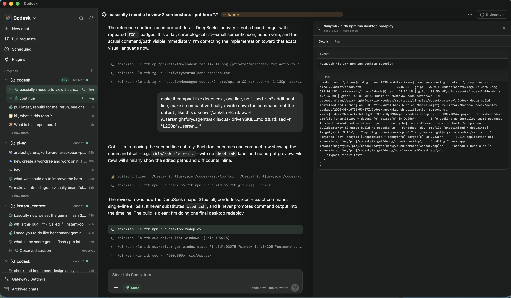

# Codesk

> Open-source control plane for coding agents, local or remote.

Codesk is a desktop app for running, monitoring, inspecting, and steering coding-agent harnesses from one place. The agent stays on the machine where the project lives—your laptop, workstation, or VPS—and Codesk connects locally or over SSH.

<p align="center">
  
</p>

## Platform support

<details open>
<summary><strong>macOS — desktop app</strong></summary>

Build and run the desktop app from source:

```bash
git clone https://github.com/dat-lequoc/codesk.git
cd codesk
npm install
npm run desktop:build -- --debug --bundles app
open target/debug/bundle/macos/Codesk.app
```

</details>

<details>
<summary><strong>Linux — execution host</strong></summary>

Linux is supported as a local or remote execution host. Build and install the daemon as a user service:

```bash
git clone https://github.com/dat-lequoc/codesk.git
cd codesk
cargo build --release -p codeskd
./target/release/codeskd install 4243
```

The desktop client connects to the daemon over SSH. A Linux desktop bundle is not published yet.

</details>

<details>
<summary><strong>Windows</strong></summary>

Windows desktop and execution-host packaging are not supported yet. Codesk currently relies on macOS/Linux service and process-management primitives.

</details>

## Supported harnesses

Codesk brings **Codex, Claude Code, OpenCode, Kiro CLI, Pi, Antigravity, DeepSeek Harness**, and generic command-line agents into one interface.

Codex has first-class support through its app server: persistent sessions, live steering, queued turns, approvals and input requests, interruption, resume, fork, and conversation backtracking.

## What you can do

- **Monitor every harness in one place.** Follow running, idle, and historical sessions without switching terminals.
- **View agent trajectories.** Inspect reasoning, commands, tool calls, file changes, results, usage, and raw provider events in chronological order.
- **Interact while agents work.** Start or resume sessions, steer an active turn, queue the next instruction, respond to requests, and interrupt or terminate runs.
- **Work over SSH.** Remote projects execute on their own host through `codeskd`; Codesk connects through an automatically recreated SSH tunnel, so tools and files stay close to the project.
- **Keep work isolated.** Run in the current checkout or use managed Git worktrees that can be inspected and cleaned up from the app.

The core rule is simple: **execution follows the project**. Codesk is the viewer and controller; the agent runs where the code lives.

## Why Codesk uses tmux

Interactive coding harnesses are terminal applications with a single live input stream. Their transcript files are excellent for rendering a conversation, but they are not a safe way to send new input. Starting another CLI process against the same session can also create competing writers, provider locks, or a conversation that appears connected while input is going somewhere else.

Codesk therefore uses tmux as the control transport for interactive sessions:

- **One stable terminal writer.** The harness owns one pseudo-terminal inside tmux, and Codesk sends Steer and Queue input to that terminal instead of starting a second provider process.
- **Survives UI and SSH reconnects.** The harness keeps running on the execution host when the desktop app, gateway, or SSH tunnel reconnects.
- **Works locally and remotely.** The same model applies on a laptop and on an SSH server; execution and tmux stay beside the project.
- **Keeps conversation parsing provider-native.** Codesk still renders Codex, Claude, Kiro, Pi, and other sessions from their real provider transcripts. tmux is used only for process lifecycle and terminal input.
- **Explicit ownership.** New Codesk runs use an isolated Codesk-owned tmux socket. Existing user tmux sessions are only controlled after **Enable control** is selected, and ordinary terminal sessions move to tmux only after the active turn is idle.
- **Recoverable access.** The Environment panel shows the tmux session name and exact local or SSH attach command, so the same harness remains directly accessible from a terminal.

This gives Codesk durable control without replacing the harness, inventing a parallel conversation protocol, or hiding where the process actually runs. Enter sends **Steer**, Tab adds a durable **Queue** item, and Shift+Enter inserts a newline.

### Kiro CLI commands

Codesk reads Kiro's command catalog directly from ACP and offers keyboard-first completion in the composer. Type `/` to browse commands, use the arrow keys to select one, and press Tab or Enter to complete it. `/model` uses Kiro's live model list, while `/effort` offers `low`, `medium`, `high`, `xhigh`, and `max`. `/compact` compacts the active Kiro conversation when it is large enough.

`/usage` needs special handling because Kiro paints it as a full-screen terminal panel that never reaches the session transcript. On a tmux-controlled session Codesk reads that panel, reports it as a usage snapshot in the conversation (plan, credits used against the plan, and the reset date), and then dismisses the panel so the next Enter still steers the same pane. Sessions driven over ACP report the same snapshot from Kiro's billing response instead.

The live regression checks cover both Kiro's ACP command protocol (`npm run test:kiro-live`) and the real tmux terminal path (`npm run test:kiro-tmux-live`). The tmux check asserts the full `/usage` contract: the session stays attached to its pane after a turn completes, the usage snapshot arrives with real credit data, and a normal steer still lands afterwards.

## Status

The desktop client is currently developed and tested on macOS. Execution hosts can be macOS or Linux, including remote hosts reached through SSH.

## Development

```bash
npm install
cargo build -p codeskd
npm run dev
```

Run the frontend test suite:

```bash
npm test          # vitest
npm run check     # tsc --noEmit && eslint src
```

Run the daemon and gateway integration suites:

```bash
npm run test:backend
```

To rebuild, safely replace, and relaunch the locally installed app:

```bash
npm run desktop:redeploy
```

## Remote daemon

On a built macOS or Linux execution host:

```bash
codeskd install 4243
```

The daemon binds to loopback and is reached through SSH forwarding.

## More

- [Architecture](./ARCHITECTURE.md)
- [Requirements](./REQUIREMENTS.md)
- [Roadmap](./docs/roadmap.md)
- [Performance benchmark](./docs/performance-benchmark.md)
- [Contributing](./CONTRIBUTING.md)
- [Security policy](./SECURITY.md)
- [License](./LICENSE)
